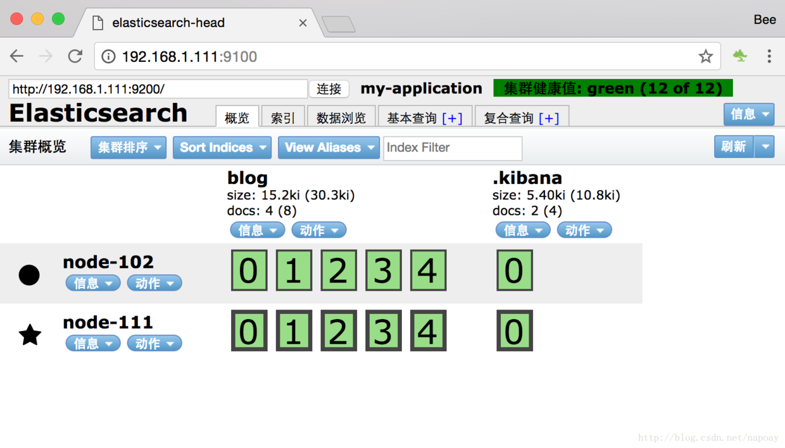

# 搭建-ElasticSearch-6-1-3分布式集群
> ELasticsearch 6.1.3要求JDK版本最低为`1.8`

mac上的本机ip为192.168.1.111,设为`master`节点，配置如下：
```yaml
cluster.name: my-application
node.name: node-111

network.host: 192.168.1.111
http.port: 9200

http.cors.enabled: true
http.cors.allow-origin: "*"

node.master: true
node.data: true
discovery.zen.ping.unicast.hosts: ["192.168.1.111"]
```
Ubuntu机器的ip位192.168.1.102，配置如下：

```yaml
cluster.name: my-application
node.name: node-102

network.host: 192.168.1.102
http.port: 9200

http.cors.enabled: true
http.cors.allow-origin: "*"

node.master: false
node.data: true
discovery.zen.ping.unicast.hosts: ["192.168.1.111"]
```

先启动mac上的master，再启动Ubuntu上的slave节点，观察输出，会有一个node-102探测到master节点的提示：

```
2017-06-07T11:33:39,369][INFO ][o.e.c.s.ClusterService   ] [node-102] detected_master {node-111}{3dQd1RRVTMiKdTckM68nPQ}{H6Zu7PAQRWewUBcllsQWTQ}{192.168.1.111}{192.168.1.111:9300}, added {{node-111}{3dQd1RRVTMiKdTckM68nPQ}{H6Zu7PAQRWewUBcllsQWTQ}{192.168.1.111}{192.168.1.111:9300},}, reason: zen-disco-receive(from master [master {node-111}{3dQd1RRVTMiKdTckM68nPQ}{H6Zu7PAQRWewUBcllsQWTQ}{192.168.1.111}{192.168.1.111:9300} committed version [8]])'
```

访问`head`，一个master一个slave组成集群，界面如下：




### 单机多节点集群配置

如果想要在一台机器上启动多个节点，步骤如下：

- 1、复制一份ELasticsearch的安装包
- 2、修改端口，比如一个是9200，一个是9205
- 3、删除data目录下的数据(如果是新解压的安装包就不必了)
