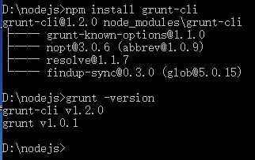
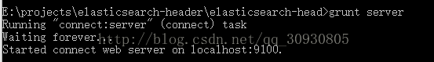

# Elasticsearch-5-5-0安装head插件

##### Tips:环境
- 楼主博客：[https://zhousiwei.gitee.io/](https://zhousiwei.gitee.io/)
- `Windows7`,`JDK-1.8`,`ElasticSearch-5.5.0`,`node-v8.1.2`,`git`

> `windows`用户建议安装个 **[TortoiseGit客户端](https://tortoisegit.org/download/)**

下载`Elasticsearch 5.5.0` ➡️ [https://www.elastic.co/downloads/elasticsearch](https://www.elastic.co/downloads/elasticsearch)

- `zip`和`tar`格式是各种系统都通用的，解压之后启动`Elasticsearch`即可。

## 1、npm安装grunt
```bash
$ npm install -g grunt-cli
$ grunt -version
```

  

#### 注意这里安装的时候路径一定要切换到`grunt-cli`文件夹下面
**这些是`Grunt file.js`中引用的，分别下载**

```bash
$ npm install grunt-contrib-copy
$ npm install grunt-contrib-concat
$ npm install grunt-contrib-uglify
$ npm install grunt-css
```

## 2、下载官方源码
> 官方源码 ➡️ [https://github.com/mobz/elasticsearch-head](https://github.com/mobz/elasticsearch-head)

```bash
$ git clone git://github.com/mobz/elasticsearch-head.git
```

## 3、修改head源码

由于`head`的代码还是2.6版本的，直接执行有很多限制，比如无法跨机器访问。因此需要用户修改两个地方：

目录：`head/Gruntfile.js`：
增加`hostname`属性，设置为`*`
```javascript
  connect: {
    server: {
      options: {
        port: 9100,
        hostname: '*',
        base: '.',
        keepalive: true
      }
    }
```

#### 3.1、修改连接地址：
目录：`head/_site/app.js`

修改`head`的连接地址:
`this.base_uri = this.config.base_uri || this.prefs.get("app-base_uri") || "http://localhost:9200";`

把`localhost`修改成你es的服务器地址，如：
`this.base_uri = this.config.base_uri || this.prefs.get("app-base_uri") || "http://10.10.10.10:9200";`

## 4、运行Elasticsearch-head

修改`elasticsearch`的参数

修改一下es使用的参数。编辑`config/elasticsearch.yml`

> 注意，设置参数的时候:后面要有**空格**！

```yaml
# 换个集群的名字，免得跟别人的集群混在一起
cluster.name: es-5.0-test

# 换个节点名字
node.name: node-101

# 修改一下ES的监听地址，这样别的机器也可以访问
network.host: 0.0.0.0

# 默认的就好
http.port: 9200

# 增加新的参数，这样head插件可以访问es
http.cors.enabled: true
http.cors.allow-origin: "*"
```

开启`ES-5.5.0`：`ElasticSearch-5.0.0\bin\elasticsearch.bat`

然后在head源码目录中，执行`npm install`进行安装：
```bash
$ npm install
```

- 初次运行安装可能会报警告或错误。可以重新运行一次`npm install`

最后，使用`grunt`命令在head源码目录下启动：
```bash
$ grunt server
```

效果如图：



> 访问 http://localhost:9100
