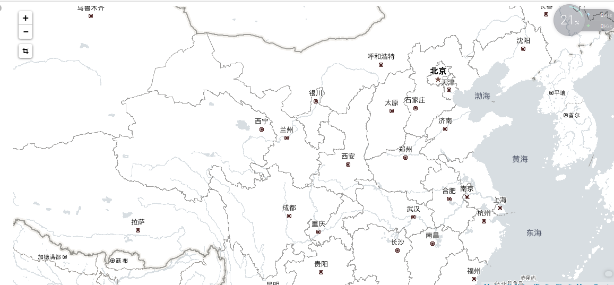

# Kibana使用高德地图

### 说明

- 目前`Kibana`默认自带的地图全部是英文，更换高德地图对地图汉化

### 一、修改配置

1、 编辑`kibana`配置文件`kibana.yml`，最后面添加

```yaml
tilemap.url: 'http://webrd02.is.autonavi.com/appmaptile?lang=zh_cn&size=1&scale=1&style=7&x={x}&y={y}&z={z}'
```

##### 删除kibana目录下的`optimize/bundles`文件夹后，重启，如果bundles目录没有新文件生成，注意权限哈！

2、 在logstash服务器下载IP地址归类查询库
```bash
# wget http://geolite.maxmind.com/download/geoip/database/GeoLite2-City.mmdb.gz
# gunzip GeoLite2-City.mmdb.gz
```

3、编辑logstash配置文件

```
input {
    stdin {}
}

 filter {
    geoip {
        source => "message"
        target => "geoip"
        database => "/usr/local/logstash-5.1.1/config/GeoLite2-City.mmdb"
        add_field => ["[geoip][coordinates]","%{[geoip][longitude]}"]
        add_field => ["[geoip][coordinates]","%{[geoip][latitude]}"]
     }
 }

 output {
        elasticsearch {
            hosts => "172.16.11.199"
            index => "logstash-map-%{+YYYY.MM.dd}"
        }
}

```

#### 配置解释
**这里为了测试，数据通过终端手动输入**

- `geoip`: IP查询插件
- `source`: 需要通过geoip插件处理的field，一般为ip，这里因为通过控制台手动输入的是ip所以直接填message，生成环境中如果查询nginx访问用户，需先将客户端ip过滤出来，然后这里填clientip即可
- `target`: 解析后的Geoip地址数据，应该存放在哪一个字段中，默认是geoip这个字段
- `database`: 指定下载的数据库文件
- `add_field`: 这里两行是添加经纬度，地图中地区显示是根据经纬度来识别

#### 效果图

