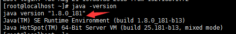
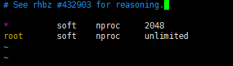

# Linux-搭建-ElasticSearch5-x

##  一、ElasticSearch5.2.2 安装
##### 1、检查 JDK版本（必须使用jdk1.8版本）
```bash
# java -version
```

##### 2、初始化环境
```bash
# service iptables status
# service iptables stop
# chkconfig iptables off
# yum install -y wget vim
# vim /etc/selinux/config   //SELINUX=enforcing更改为SELINUX=disabled
# reboot
```
##### 3、下载安装ElasticSearch5.2.2
```bash
# cd /usr/local/
# wget https://artifacts.elastic.co/downloads/elasticsearch/elasticsearch-5.5.2.tar.gz
# tar -zxvf elasticsearch-5.5.2.tar.gz
# cd elasticsearch-5.5.2/
# vim config/elasticsearch.yml    //添加如下配置
```
```yaml
# 配置es的集群名称, es会自动发现在同一网段下的es,如果在同一网段下有多个集群,就可以用这个属性来区分不同的集群
cluster.name: elasticsearch
# 节点名称
node.name: "es_client"
bootstrap.memory_lock: false
bootstrap.system_call_filter: false
network.host: 0.0.0.0
```


##### 4、因为安全问题 elasticsearch 不让用root用户直接运行，所以要创建新用户并运行
```bash
# groupadd elsearch
# useradd elsearch -g elsearch -p elasticsearch
# chown -R elsearch:elsearch /usr/local/elasticsearch-5.5.2  //更改用户权限
# su elsearch
# ./bin/elasticsearch
```
##### Tips：启动发现报错


切换成root用户执行以下命令
```bash
# su root
# vim /etc/security/limits.conf
//添加如下内容:
* soft nofile 65536
* hard nofile 131072
* soft nproc 2048
* hard nproc 4096
```


```bash
# vim /etc/security/limits.d/90-nproc.conf
//修改如下内容：
* soft nproc 1024
#修改为
* soft nproc 2048
```


```bash
# vim /etc/sysctl.conf
添加下面配置：
vm.max_map_count=655360
并执行命令：
# sysctl -p
```

##### 重新启动ElasticSearch
```bash
# su elsearch
# ./bin/elasticsearch
# ./bin/elasticsearch -d  //后台运行
```