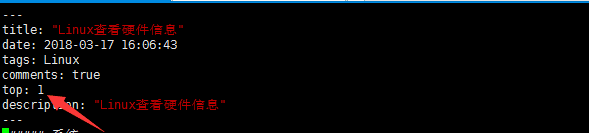

# 新增Hexo博客文章置顶功能

> [博主博客地址](https://zhousiwei.gitee.io/)

##### 修改Hexo文件夹下的`node_modules/hexo-generator-index/lib/generator.js`
需要添加的代码：
```javascript
posts.data = posts.data.sort(function(a, b) {
      if(a.top && b.top) {
          if(a.top == b.top) return b.date - a.date;
          else return b.top - a.top;
      }
      else if(a.top && !b.top) {
          return -1;
      }
      else if(!a.top && b.top) {
          return 1;
      }
      else return b.date - a.date;
  });
```

以下是最终的generator.js内容：

```javascript
'use strict';

var pagination = require('hexo-pagination');

module.exports = function(locals) {
  var config = this.config;
  var posts = locals.posts.sort(config.index_generator.order_by);

  posts.data = posts.data.sort(function(a, b) {
      if(a.top && b.top) {
          if(a.top == b.top) return b.date - a.date;
          else return b.top - a.top;
      }
      else if(a.top && !b.top) {
          return -1;
      }
      else if(!a.top && b.top) {
          return 1;
      }
      else return b.date - a.date;
  });

  var paginationDir = config.pagination_dir || 'page';
  var path = config.index_generator.path || '';

  return pagination(path, posts, {
    perPage: config.index_generator.per_page,
    layout: ['index', 'archive'],
    format: paginationDir + '/%d/',
    data: {
      __index: true
    }
  });
};
```
----
如何使用：在需要置顶的文章添加top属性即可，排序从小到大

----
博客效果：

----
##### Tips:常用hexo命令
```bash
# hexo n == hexo new
# hexo g == 生成
# hexo s == 启动服务
```