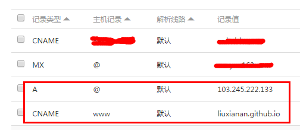
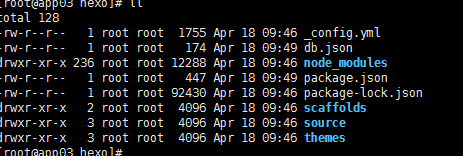
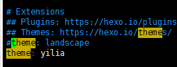
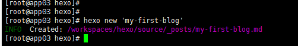
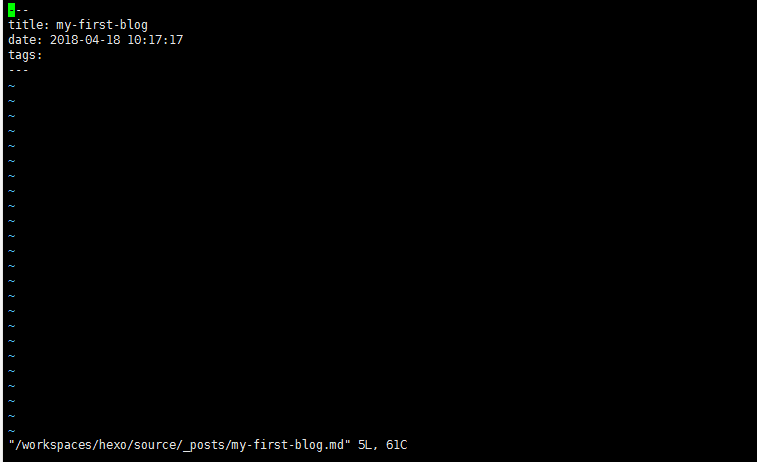

# 使用Hexo+GitHub搭建免费个人博客

- 博主GitHub博客地址:[https://joeybling.github.io/](https://joeybling.github.io/ "https://joeybling.github.io/")
- 联系QQ:`2434387555`
- 此博客的所有操作均在`Linux`上完成

> 本文所使用的环境：`Centos 6.5Final@64Bit`、`NodeJs@v8.11.1`、`hexo@3.2.2`

### 1、前言

使用`github-pages`服务搭建博客的好处有：

> 1. 全是静态文件，访问速度快；
> 2. 免费方便，不用花一分钱就可以搭建一个自由的个人博客，不需要服务器不需要后台；
> 3. 可以随意绑定自己的域名，不仔细看的话根本看不出来你的网站是基于github的；
> 4. 数据绝对安全，基于github的版本管理，想恢复到哪个历史版本都行；
> 5. 博客内容可以轻松打包、转移、发布到其它平台；
> 6. 等等；

#### 1.1、准备工作
- 有一个github账号，没有的话去注册一个
- 安装了`node.js`、`npm`，并了解相关基础知识
- **传送门 ➡️ [Linux上安装node和npm](https://www.jianshu.com/p/f8b0a4f7a822 "Linux上安装node和npm")**

### 2、搭建GitHub博客
#### 2.1、创建仓库

建一个名为`你的用户名.github.io`的仓库，比如说，如果你的github用户名是test，那么你就新建`test.github.io`的仓库（必须是你的用户名，其它名称无效），将来你的网站访问地址就是 [http://test.github.io](http://test.github.io "http://test.github.io")了，是不是很方便？
几个注意的地方：

- 注册的邮箱一定要验证，否则不会成功；
- 仓库名字必须是：`username.github.io`，其中username是你的用户名；
- 仓库创建成功不会立即生效，需要过一段时间，大概3-10分钟左右
- 仓库创建成功后需要开启pages服务 **settings ➡️ GitHub Pages ➡️ 选择分支并开启服务**

#### 2.2、绑定域名(`看自己选择是否使用`)

##### 绑定域名分2种情况：带www和不带www的。

##### 域名配置最常见有2种方式，CNAME和A记录，CNAME填写域名，A记录填写IP，由于不带www方式只能采用A记录，所以必须先ping一下你的用户名.github.io的IP，然后到你的域名DNS设置页，将A记录指向你ping出来的IP，将CNAME指向你的用户名.github.io，这样可以保证无论是否添加www都可以访问，如下：



##### 然后到你的github项目根目录新建一个名为CNAME的文件（无后缀），里面填写你的域名，加不加www看你自己喜好，因为经测试：
- 如果你填写的是没有www的，比如 mygit.me，那么无论是访问 http://www.mygit.me 还是 http://mygit.me ，都会自动跳转到 http://mygit.me
- 如果你填写的是带www的，比如 www.mygit.me ，那么无论是访问 http://www.mygit.me 还是 http://mygit.me ，都会自动跳转到 http://www.mygit.me
- 如果你填写的是其它子域名，比如 abc.mygit.me，那么访问 http://abc.mygit.me 没问题，但是访问 http://mygit.me ，不会自动跳转到 http://abc.mygit.me

**另外说一句，在你绑定了新域名之后，原来的你的用户名.github.io并没有失效，而是会自动跳转到你的新域名。**

### 3、使用hexo写博客
#### 3.1、安装hexo
```bash
# npm install -g hexo-cli
# 做个软链接
# cd /usr/local/bin
# 这是是你的Node解压安装的路径
# ln -s /opt/node-v8.11.1-linux-x64/bin/hexo
```
#### 3.2、初始化
在某个地方新建一个名为hexo的文件夹
```bash
# mkdir -p /workspaces/hexo
# cd /workspaces/hexo/
# hexo init
```
目录结构如下图:



```bash
# hexo g # 生成
# hexo s # 启动服务
```

打开浏览器访问 http://IP:4000 即可看到内容 如下:


#### 3.3、修改主题
- 有哪些好看的 Hexo 主题？ 传送门 ➡️ [https://www.zhihu.com/question/24422335](https://www.zhihu.com/question/24422335 "https://www.zhihu.com/question/24422335")
- 个人比较喜欢的 ➡️ [https://github.com/litten/hexo-theme-yilia](https://github.com/litten/hexo-theme-yilia "https://github.com/litten/hexo-theme-yilia")

```bash
# cd /workspaces/hexo/themes/
# yum install -y wget
# wget https://codeload.github.com/litten/hexo-theme-yilia/zip/master
# yum install -y unzip
# unzip master
# mv hexo-theme-yilia-master/ yilia
# ll
```
下载后的主题都在这里：


##### 修改`_config.yml`中的`theme: landscape`改为`theme: yilia`，然后重新执行`hexo g`来重新生成。

##### 如果出现一些莫名其妙的问题，可以先执行`hexo clean`来清理一下public的内容，然后再来重新生成和发布。

```bash
# yum install -y vim
# 修改_config.yml中的theme: landscape改为theme: yilia
# vim /workspaces/hexo/_config.yml
# 重新生成
# hexo g
# hexo s
```


#### 3.4、上传到GitHub
#####上传public 文件夹里所有的文件 ，可以拷贝出来使用git上传到GitHub

#### 3.5、常用`hexo`命令

- `hexo new "postName"` 新建文章
- `hexo new page "pageName"` 新建页面
- `hexo generate` 生成静态页面至public目录
- `hexo server` 开启预览访问端口（默认端口4000，'ctrl + c'关闭server）
- `hexo deploy` 部署到GitHub
- `hexo help` 查看帮助
- `hexo version` 查看Hexo的版本

> 缩写：

- `hexo n` == `hexo new`
- `hexo g` == `hexo generate`
- `hexo s` == `hexo server`
- `hexo d` == `hexo deploy`

> 组合命令：

- `hexo s -g` 生成并本地预览
- `hexo d -g` 生成并上传

#### 3.6、`_config.yml`文件配置

> 需要特别注意的地方是，冒号后面必须有一个空格，否则可能会出问题。

#### 3.7、写博客
定位到我们的hexo根目录，执行命令：

```bash
# hexo new 'my-first-blog'
```

##### `hexo`会帮我们在_posts下生成相关md文件：

##### 我们只需要打开这个文件就可以开始写博客了，默认生成如下内容：

##### 当然你也可以直接自己新建md文件，用这个命令的好处是帮我们自动生成了时间。
一般完整格式如下：

```html
---
title: postName #文章页面上的显示名称，一般是中文
date: 2013-12-02 15:30:16 #文章生成时间，一般不改，当然也可以任意修改
categories: 默认分类 #分类
tags: [tag1,tag2,tag3] #文章标签，可空，多标签请用格式，注意:后面有个空格
description: 附加一段文章摘要，字数最好在140字以内，会出现在meta的description里面
---
以下是正文.....
```


##### 推荐一个在线写博客工具 ➡️ [http://pandao.github.io/editor.md/](http://pandao.github.io/editor.md/ "http://pandao.github.io/editor.md/")
##### Tips:如何让博文列表不显示全部内容

默认情况下，生成的博文目录会显示全部的文章内容，如何设置文章摘要的长度呢？

答案是在合适的位置加上
```html
<!-- more -->
```
即可，例如：

```html
# 前言

使用github pages服务搭建博客的好处有：

1. 全是静态文件，访问速度快；
2. 免费方便，不用花一分钱就可以搭建一个自由的个人博客，不需要服务器不需要后台；
3. 可以随意绑定自己的域名，不仔细看的话根本看不出来你的网站是基于github的；

<!--more-->

4. 数据绝对安全，基于github的版本管理，想恢复到哪个历史版本都行；
5. 博客内容可以轻松打包、转移、发布到其它平台；
6. 等等；
```
最终效果：

