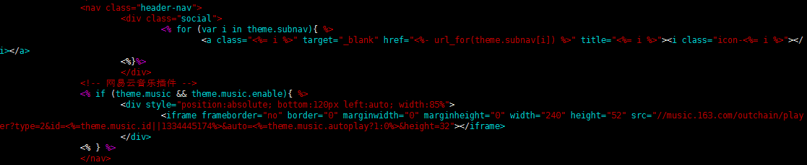

# Hexo博客yilia主题添加背景音乐-（网易云音乐）

- [博主博客地址](https://zhousiwei.gitee.io/)

##### 1、打开网易云音乐首页，复制选择的背景音乐分享外链
> [网易云音乐](http://music.163.com/)

---
##### 2、引入播放器代码
&#160;&#160;&#160;&#160;在`themes/yilia/layout/_partial/left-col.ejs`文件`nav`标签中添加代码
> 注：放在`<nav>`和`</nav>`之内

&#160;&#160;&#160;&#160;**笔者添加了一些判断和表达式**
```ejs
<!-- 网易云音乐插件 -->
<% if (theme.music && theme.music.enable){ %>
	<div style="position:absolute; bottom:120px left:auto; width:85%">
		<iframe frameborder="no" border="0" marginwidth="0" marginheight="0" width="240" height="52" src="//music.163.com/outchain/player?type=2&id=<%=theme.music.id||1334445174%>&auto=<%=theme.music.autoplay?1:0%>&height=32"></iframe>
	</div>
<% } %>
```


---
##### 3、在yilia主题配置文件中添加属性
```yaml
# 网易云音乐插件
music:
  enable: true
  #id: 1332647902  # 网易云分享的ID
  autoplay: true  # 是否开启自动播放
```