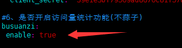
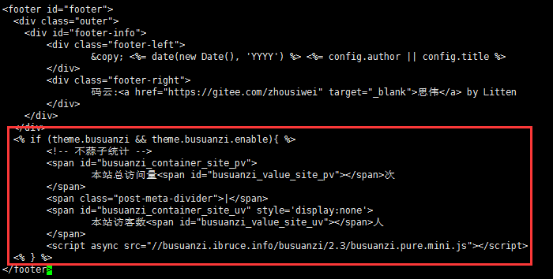
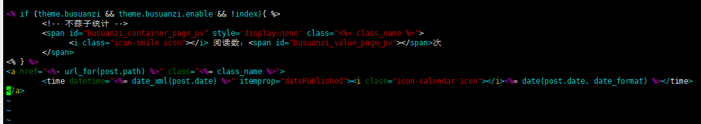

# Hexo博客添加访问量统计

##### Tips:前导必备
- [博主博客地址](https://joeybling.github.io/)
- 博主使用的是`yilia`主题
- 访问量统计使用**[不蒜子](http://busuanzi.ibruce.info/ "不蒜子")**

-----------------------------------------------------------------------------------------
##### 1、配置是否开启不蒜子访问量统计功能
&#160;&#160;&#160;&#160;在`themes/yilia/_config.yml`添加属性
```yaml
# 是否开启访问量统计功能(不蒜子)
busuanzi:
 enable: true
```


-----------------------------------------------------------------------------------------
##### 2、引入不蒜子并添加站点访问量
&#160;&#160;&#160;&#160;在`themes/yilia/layout/_partial/footer.ejs`末尾添加如下代码
```html
<% if (theme.busuanzi && theme.busuanzi.enable){ %>
        <!-- 不蒜子统计 -->
        <span id="busuanzi_container_site_pv">
                本站总访问量<span id="busuanzi_value_site_pv"></span>次
        </span>
        <span class="post-meta-divider">|</span>
        <span id="busuanzi_container_site_uv" style='display:none'>
                本站访客数<span id="busuanzi_value_site_uv"></span>人
        </span>
        <script async src="//busuanzi.ibruce.info/busuanzi/2.3/busuanzi.pure.mini.js"></script>
  <% } %>
```


-----------------------------------------------------------------------------------------
##### 3、添加文章访问量
&#160;&#160;&#160;&#160;在`themes/yilia/layout/_partial/post/date.ejs`开头添加如下代码
```html
<% if (theme.busuanzi && theme.busuanzi.enable && !index){ %>
        <!-- 不蒜子统计 -->
        <span id="busuanzi_container_page_pv" style='display:none' class="<%= class_name %>">
              <i class="icon-smile icon"></i> 阅读数：<span id="busuanzi_value_page_pv"></span>次
        </span>
<% } %>
```

- **重启即可查看效果**

-----------------------------------------------------------------------------------------
##### 4、作者寄语
> Everything is ok. But you have to do by yourself.
