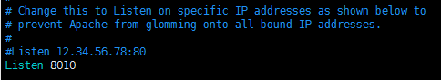

# Linux中Apache(httpd)安装、配置

### 1、yum安装
```bash
--- 先yum list看看有没有你可以的包
# yum list httpd
--- 如果有的话，比如我用x86_64版，就可以安装
# yum install httpd.x86_64
```

### 2、配置、启动Apache
##### 2.1、`httpd.conf`是主配置文件，你可以按需更改，一般来说可能需要自定义端口，那么就`vim`修改`httpd.conf`文件的监听端口，改为你希望的



查找httpd.conf文件位置

```bash
# find / -name httpd.conf
```

##### 2.2、启动、关闭、重启

```bash
# ./apachectl start
# ./apachectl stop
# ./apachectl restart
```

一般此文件在 /usr/sbin 目录下

### 3、Apache设置为Linux系统服务，并开机启动

##### 3.1、将链接`apachectl`复制到系统启动目录下并命名为`httpd`

```bash
# cp /usr/local/httpd/bin/apachectl /etc/rc.d/init.d/httpd
```

到此，其实已经可以使用`service httpd start`等命令，但在linux服务列表还没有注册

##### 3.2、使用`chkconfig`来注册`apache`服务，并其可以在linux的服务列表中看到（`chkconfig --list`）

###### 在`init.d`的`httpd`链接文件中第2行添加如下注释，并`wq`保存退出

```bash
# vim /etc/rc.d/init.d/httpd
```


###### 将`httpd`配置自启并加入linux服务监控

```bash
# chkconfig --add httpd
```

全局可以使用命令：

```bash
# service httpd start
# service httpd stop
# service httpd restart
```