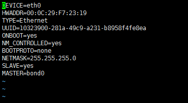
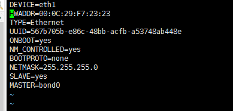
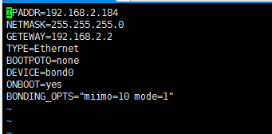

# Linux中bond网卡绑定方法

> 首先在虚拟机上添加俩块虚拟网卡（具体做法不在赘述）

##### 然后为网卡添加配置文件。文件内容如下：
```bash
# vi /etc/sysconfig/network-scripts/ifcfg-eth0
# vi /etc/sysconfig/network-scripts/ifcfg-eth1
```





`HWADDR`对应mac地址 `ifconfig -a` 可以查看
`UUID`对应网卡UUID ➡️ [Linux 查看网卡UUID](https://www.jianshu.com/p/d9137881309c)

###### 两块网卡的配置文件差不多，就是mac地址和设备名称还有UUID需要更改。

###### 接下来就是要添加bond网卡的配置文件
```bash
# vi /etc/sysconfig/network-scripts/ifcfg-bond0
```



- Tips:`BONDING_OPTS="miimo=10 mode=1"` 网卡配置模式以及通讯时间（单位为毫秒）
- [在linux中实现多网卡的绑定 介绍常见的7种Bond模式](http://www.cnblogs.com/nulige/p/6714183.html)


**最后重启网络服务。（在7.0以上的版本有`NetworkManager`，需要关闭此项服务，bond网卡才能生效）**
