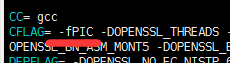
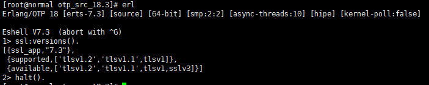

# Linux下安装Erlang

### Linux下安装Erlang
##### 一、升级openssl
```bash
# cd /usr/local/
# wget http://www.openssl.org/source/openssl-1.0.1s.tar.gz
# tar -zxvf openssl-1.0.1s.tar.gz
# cd openssl-1.0.1s
# ./config --prefix=/usr/local/openssl
# vim Makefile
--修改CFLAG= -DOPENSSL_THREADS 修改成 CFLAG= -fPIC -DOPENSSL_THREADS
--也就是添加 -fPIC
# make && make install
```



##### 二、安装Erlang
```bash
# cd /usr/local/
# wget http://erlang.org/download/otp_src_18.3.tar.gz
# tar -zxvf otp_src_18.3.tar.gz
# cd otp_src_18.3
--创建Erlang安装目录
# mkdir /usr/local/erlang
--ErLang安装依赖
# yum install -y gcc gcc-c++ unixODBC-devel openssl-devel ncurses-devel
# ./configure --prefix=/usr/local/erlang
# make && make install
--配置Erlang环境变量
# vim /etc/profile
文件末尾添加 export PATH=$PATH:/usr/local/erlang/bin
# source /etc/profile
```
##### 三、验证erlang是否安装成功
```bash
# erl
# ssl:versions().
# halt().
```

