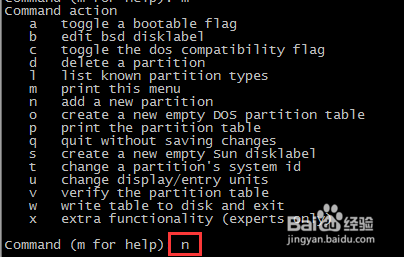
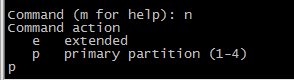
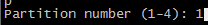

# fdisk分区不超过2T的磁盘

##### 不超过2T的磁盘都可以使用fdisk命令进行分区，如果超过2T，用fdisk每次最多也只能分2T的空间

### 1、首先用`fdisk -l`发现待分区的磁盘 /dev/sdb
```bash
# fdisk -l
```


### 2、`fdisk /dev/sdb`对该磁盘进行分区，输入`m`并回车
```bash
# fdisk /dev/sdb
```


### 3、输入`n`并回车，`n`是“new”新建分区的意思




### 4、输入`p`并回车




### 5、输入数字1并回车



### 6、采用默认值一直回车会将整个20G都分给/dev/sdb1


### 7、输入`w`  "write"并回车，意思是对刚才的结果进行保存


### 8、再次使用`fdisk -l`查看分区的结果

如图分的新区为`/dev/sdb1`,，创建的新区格式化后就可以挂载使用了


```bash
# reboot
--- 重启一下，防止报错: Could not stat /dev/sdsa4 --- No such file or directory
```


```bash
# mkfs -t ext3 /dev/sdb1
# mount /dev/sdb1 /data
# df -hT
```