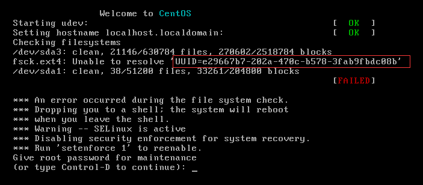
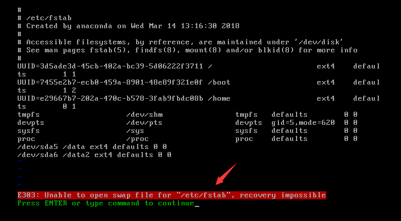
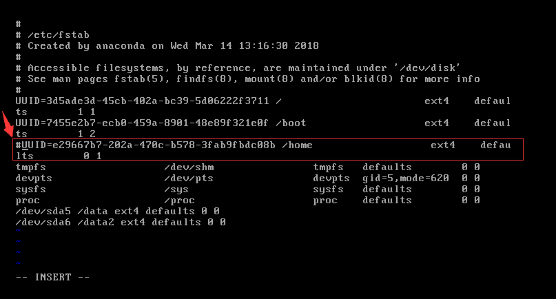

# Linux下fsck-ext4-Unable-to-resolve问题记录

##### linux启动报错:




##### 由于其他原因将分区UUID为e29667b7-.... 删除了，重启系统发现fsck 文件系统时failed

##### 问题解决：
在(or type control -D to continue):后面输入root密码后回车

```bash
# vi /etc/fstab
```

在编辑该文件的时候，系统提示该文件为只读，无法编辑，原因是在进入单用户模式后，由于根分区是只读的，需要通过重新挂载



```bash
# mount -o remount,rw /
# vi /etc/fstab
```
把无法挂载的分区那一行行首用`#`注释掉或将那一行直接删除掉，重新启动就OK了。


```bash
# reboot
```
