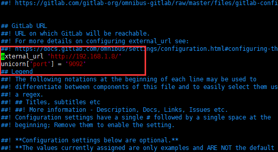

# Linux搭建GitLab并汉化

### 一、环境准备
##### 1.1、下载wget
```bash
# yum install -y vim
# yum install -y wget
# cd /usr/local
# wget https://mirrors.tuna.tsinghua.edu.cn/gitlab-ce/yum/el6/gitlab-ce-10.0.2-ce.0.el6.x86_64.rpm
```

##### 1.2、关闭防火墙
```bash
# service iptables stop
# chkconfig iptables off
```

### 二、获取GitLab汉化包`（要部署非汉化版，可以跳过这一块内容）`
##### 2.1、安装Git
```bash
# yum install -y git
```

##### 2.2、克隆获取汉化版本库
```bash
# cd /usr/local
# git clone https://gitlab.com/xhang/gitlab.git
```

### 三、部署社区版GitLab
##### 3.1、安装GitLab的依赖项
```bash
# yum -y install policycoreutils openssh-server openssh-clients postfix cronie policycoreutils-python
```

##### 3.2、启动postfix，并设置为开机启动
```bash
# service postfix start
# chkconfig postfix on
```

##### 3.3、安装rpm包
```bash
# cd /usr/local
# rpm -ivh gitlab-ce-10.0.2-ce.0.el6.x86_64.rpm
```

##### 3.4、修改配置文件gitlab.rb
```bash
# vim /etc/gitlab/gitlab.rb
将external_url变量的地址修改为gitlab所在centos的ip地址
修改GitLab默认端口

unicorn['port'] = '9092'
```



因为修改了配置文件，故需要重新加载配置内容。

```bash
# gitlab-ctl reconfigure
# gitlab-ctl restart
```

### 四、覆盖汉化包
##### 4.1、停止GitLab服务
```bash
# gitlab-ctl stop
```

##### 4.2、比较汉化标签和原标签，导出 patch 用的 diff 文件到/root下
```bash
# cd /usr/local/gitlab
# git diff v10.0.2 v10.0.2-zh > ../10.0.2-zh.diff
```

##### 4.3、将10.0.2-zh.diff作为补丁更新到GitLab中
```bash
# cd /usr/local
# yum install patch -y
# patch -d /opt/gitlab/embedded/service/gitlab-rails -p1 < 10.0.2-zh.diff
Tips:重启GitLab
# gitlab-ctl reconfigure
# gitlab-ctl restart
```