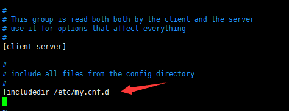
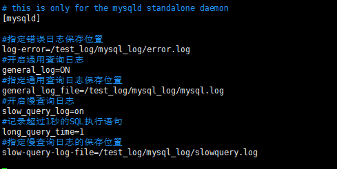

# Linux开启MySQL日志

```bash
# vim /etc/my.cnf
```

如果里面存在   `!includedir /etc/my.cnf.d`



则
```bash
# vim /etc/my.cnf.d/server.cnf
没有就是
# vim /etc/my.cnf
#在mysqld标签下添加
#指定错误日志保存位置
log-error=/test_log/mysql_log/error.log
#开启通用查询日志
general_log=ON
#指定通用查询日志保存位置
general_log_file=/test_log/mysql_log/mysql.log
#开启慢查询日志
slow_query_log=on
#记录超过1秒的SQL执行语句
long_query_time=1
#指定慢查询日志的保存位置
slow-query-log-file=/test_log/mysql_log/slowquery.log
```



#### 重启MySQL

```bash
service mysqld restart
```
