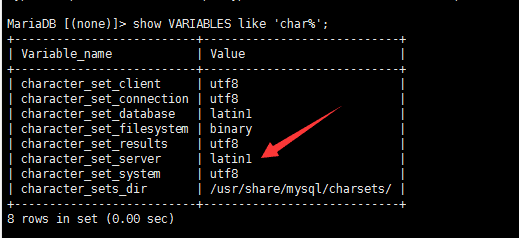
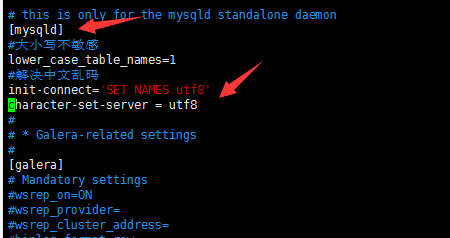

# 解决MariaDB中文乱码

#### 1、检查自己数据库编码
```bash
# mysql -uroot -proot
# show VARIABLES like 'char%';
```



#### 2、更改Client和Server编码都是UTF-8

```bash
# vim /etc/my.cnf.d/server.cnf
```

**在`server.cnf`中`[mysqld]`标签下添加代码**

```properties
	init-connect='SET NAMES utf8'
	character-set-server = utf8
```



###### 重启MariaDB即可
```bash
# systemctl restart mariadb
--- 如果已经添加为服务
# service mysqld restart
```
