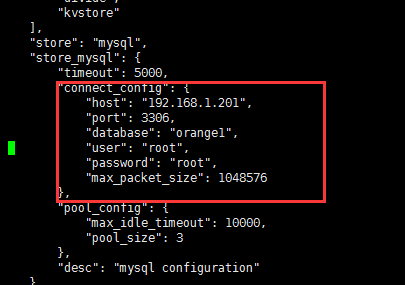

# Linux安装OpenResty-api-网关-Orange

#### 1.安装openresty
```bash
# yum -y install libuuid-devel pcre-devel openssl-devel gcc-c++ wget
# mkdir /openresty
# cd /openresty
# wget https://openresty.org/download/openresty-1.9.15.1.tar.gz
# tar -zxf openresty-1.9.15.1.tar.gz
# cd openresty-1.9.15.1
# ./configure --with-http_stub_status_module --with-http_v2_module --with-http_ssl_module 
# gmake && gmake install
# ln -s /usr/local/openresty/nginx/sbin/nginx /usr/sbin/nginx
# nginx -v
```
#### 2.创建MySQL数据库并导入数据(脚本在orange/install文件夹下)
```bash
# yum -y install mariadb-server
# mysql -u root
# CREATE DATABASE orange CHARACTER SET utf8 COLLATE utf8_general_ci;
# CREATE USER 'orange'@'%' IDENTIFIED BY 'orange';
# GRANT ALL PRIVILEGES ON orange.* TO 'orange'@'%';
# FLUSH PRIVILEGES;
# 最后一定要执行mysql的数据库导入。
# mysql -u orange -porange -h 10.0.2.15 orange < orange-v0.6.2.sql
```
#### 3.安装Orange
###### Tips:安装之前需要 lor 框架，否则启动有问题。
```bash
# yum install -y git
# git clone https://github.com/sumory/lor.git
# cd lor
# make install
```
###### 启动并配置 orange 服务
```bash
# service iptables stop
# chkconfig iptables off
# git clone https://github.com/sumory/orange.git
# cd orange
# vim conf/orange.conf
# sh start.sh
```



##### 访问地址: http://IP:9999

#### Tips:启动不起来查看端口占用情况杀掉其他进程
```bash
# netstat -tunlp |grep 80
```
