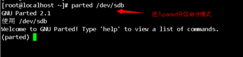
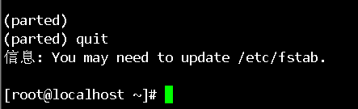

# Centos用parted分区超过2TB硬盘-分区格式化

### 1、问题描述
##### 1、问题一
CentOS 6.x 在格式化大于16TB的ext4分区时，会提示如下错误：
```
mke2fs 1.41.12 (17-May-2010)
mkfs.ext4: Size of device /dev/sda1 too big to be expressed
in 32 bits using a blocksize of 4096.
```
##### 2、问题二

> CentOS 6.x 无法使用fdisk分区大于2TB的磁盘。

### 2、原因分析
##### 1、问题一：
原因在于CentOS 自带的 e2fsprogs 版本为1.41.12较低，无法创建16TB以上的文件系统。
##### 2、问题二：
原因在于MBR分区表只支持2T磁盘。

### 3、解决方案
##### 1、问题一：
解决方案为手工下载最新的e2fsprogs源码包，进行编译安装，然后使用`mkfs.ext4`命令使用64位的方式进行磁盘格式化。

##### 2、问题二：
使用parted命令将MBR分区表，改为GPT分区表。

通过输入`print 设备名`进入分区命令行模式如下图


通过`parint`打印列出当前分区设备的磁盘容量大小，如下图12.9tb


设置磁盘分区为gpt模式，`mklabel gpt`然后点击YEs继续(提示磁盘的数据可能会丢失是否继续）


提示下面警告，再`mkpart primary 0 12.9TB`，下一条警告忽略继续即可输入 i 或者 ignore（primary为分区的名字，如图中所示）


退出parted，设置好之后输入`quit`退出（本经验以最简单的一个盘分一个区为例）



### 分区格式化
把创建好的大分区进行格式化，通过`fdisk -l`再次查看确认


直接用`mkfs.ext4 /dev/sdb1`格式化会报错，在文章开头已经介绍了，这里我们先下载最新的e2fsprogs源码包，下载地址如下：
[ftp://ftp.ntu.edu.tw/linux/kernel/people/tytso/e2fsprogs/](ftp://ftp.ntu.edu.tw/linux/kernel/people/tytso/e2fsprogs/)

下载的版本为1.43.8，进行编码安装：

```bash
tar -zxvf e2fsprogs-1.43.8.tar.gz
cd e2fsprogs-1.43.8
mkdir build
cd build/
../configure (如果linux系统是最小化安装，会缺少gcc相关依赖包../configure之前要先安装gcc，命令yum install gcc，否则configure失败下一步make操作无法进行)
make
make install
```

编译完成后使用如下命令格式化：

```bash
mke2fs -O 64bit,\
has_journal,extents,\
huge_file,flex_bg,uninit_bg,\
dir_nlink,\
extra_isize \
-i 4194304 \
/dev/sbd1
或者：
mkfs.ext4 -O 64bit /dev/sdb1（建议用这个）
```
