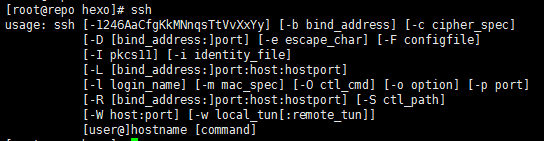
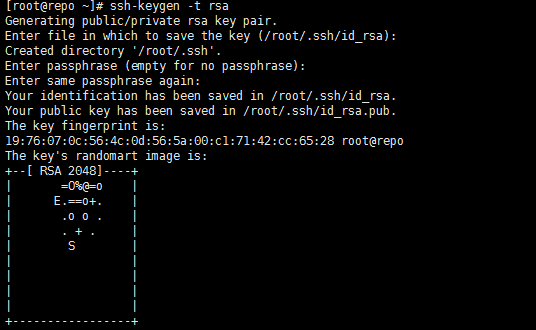
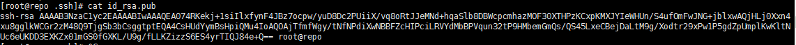
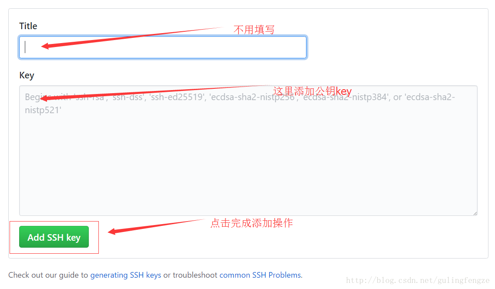

# Linux配置SSH-Key到GitHub

#### 1、生成SSH Key
**首先检查下本机是否已经安装了SSH，在终端输入ssh即可：**



如果没有安装进行yum安装

```bash
# yum -y install openssh-clients
```

###### 接下来就是生成`ssh key`了，输入`ssh-keygen -t rsa`，然后连续按回车键三次（注意：千万不要输入密码！）。


`id_rsa.pub`为公钥，`id_rsa`为私钥，它们都是隐藏文件。
那么如何查看它们的内容呢？只需要继续执行以下两条命令即可。

```bash
# cd .ssh/
# cat id_rsa.pub
```


#### 2、添加SSH Key到GitHub上


接着执行下面操作：


点击New SSH Key按钮后进行Key的填写操作，完成SSH Key的添加。如下图：



添加SSH Key成功之后，继续输入命令进行测试。

```bash
# ssh -T git@github.com
```


出现上图结果则说明添加SSH Key成功。
