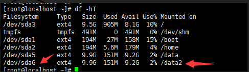
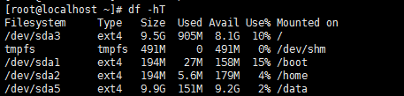
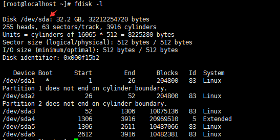
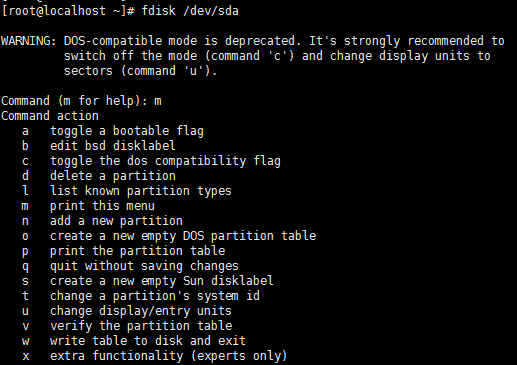
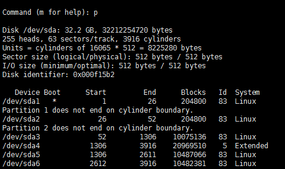
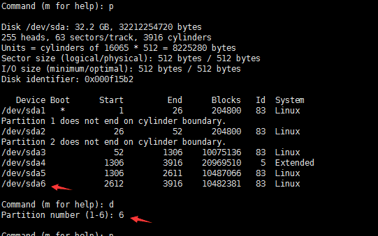
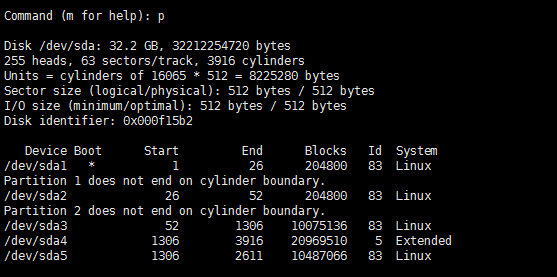
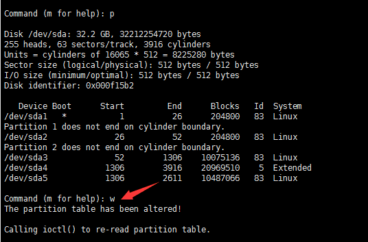
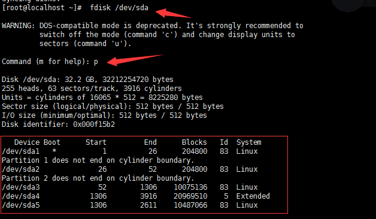

# Linux-卸载分区

##### 注意，卸载分区会格式化分区内所有的数据，请谨慎操作或进行数据备份

```bash
# df -hT
```



```bash
准备卸载/dev/sda6这个分区
# umount /data2
重新检查一下
# df -hT
```



```bash
# fdisk -l
发现待分区的磁盘 /dev/sda
```



```bash
对该磁盘进行卸载分区，输入m并回车
# fdisk /dev/sda
# m 输入帮助
# p 打印分区表
```





卸载/dev/sda6分区
此时注意/dev/sda6是刚刚卸载了/data2的分区名


```bash
# d 删除一个分区
# 6  删除第六个分区
```



```bash
重新打印分区表发现已卸载/dev/sda6分区
# p
```



```bash
# w   将表写入磁盘并退出
再检查一遍
# fdisk /dev/sda
# p 打印分区表
```




