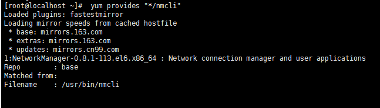
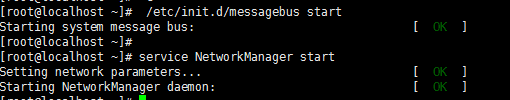
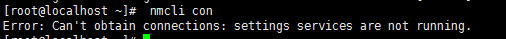
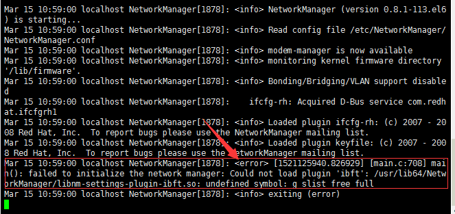
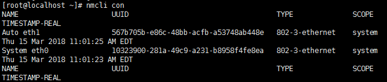

# Linux-查看网卡UUID

### Linux 查看网卡UUID
##### 1、首先我们查看一下`nmcli`是哪个软件包提供的
```bash
# yum provides "*/nmcli"
```



##### 2、安装NetworkManager服务
```bash
# yum -y install NetworkManager
```

##### 3、启动NetworkManager服务
```bash
# service NetworkManager start
```


##### 4、查看网卡UUID
```bash
# nmcli con
```

**Tips:如果有发现有报错**

```bash
-- 查看/var/log/messages日志
# vi /var/log/messages
tips:按两下大写的G跳到最后一页
报错：
...
Apr 20 14:53:05 localhost NetworkManager[2013]: <info> NetworkManager (version 0.8.1-113.el6) is starting...
Apr 20 14:53:05 localhost NetworkManager[2013]: <info> Read config file /etc/NetworkManager/NetworkManager.conf
Apr 20 14:53:05 localhost NetworkManager[2013]: <error> [1492671185.606620] [nm-dbus-manager.c:278] nm_dbus_manager_init_bus(): Could not get the system bus.  Make sure the message bus daemon is running!  Message: Failed to connect to socket /var/run/dbus/system_bus_socket: Connection refused
...
-- 需要先启动messagebus，再启动NetworkManager
# /etc/init.d/messagebus start
# service NetworkManager start
```



##### 5、运行`nmcli`
```bash
# nmcli con
```

报错:


```bash
# vi /var/log/messages
```

发现有报错


##### `g_slist_free_full` 属于`glist` 的一个方法，缺少`glist`
##### 解决方法:
```bash
# yum -y install glib2-devel
```

##### 6、此时再运行nmcli即可查看网卡UUID
```bash
# service NetworkManager start
# nmcli con
```

