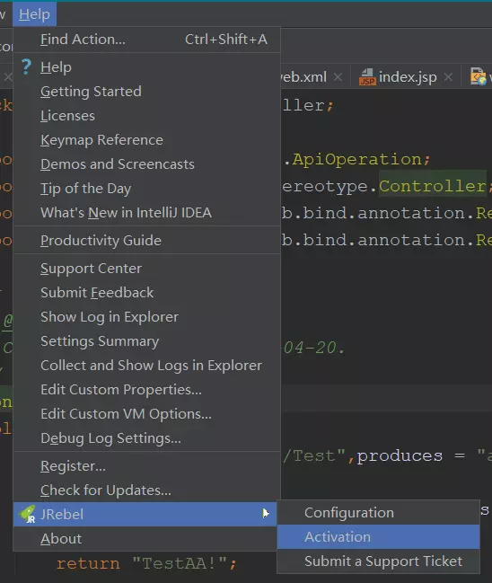
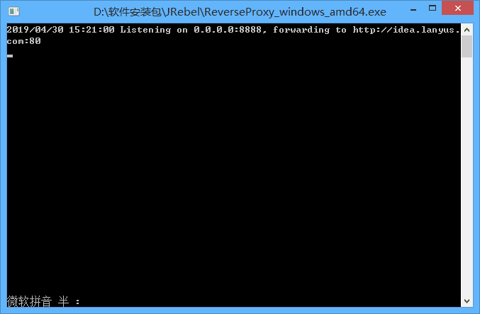
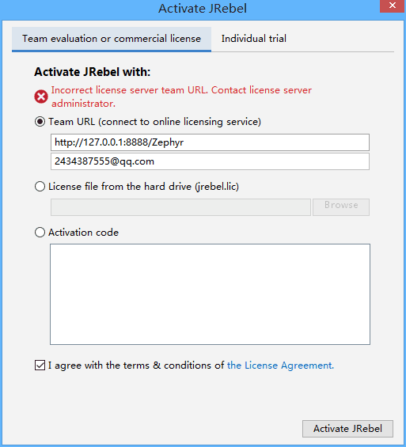

# IDEA+JRebel全自动热部署

- 链接：[https://pan.baidu.com/s/1ZE5cv1vhFQhdaj91dFD-GA](https://pan.baidu.com/s/1ZE5cv1vhFQhdaj91dFD-GA) 密码：b2k8
下载后解压

---
##### 1、打开IDEA离线安装插件，选择刚刚下载的ZIP就行了

---

##### 2、激活JRebel
装完以后打开 `IDEA` ➡️ `Help` ➡️ `JRebel` ➡️ `Activation`

**运行激活程序**

地址填写 `http://127.0.0.1:8888/Zephyr` 邮箱随便填

---

##### 3、使用及自动部署
依次打开 `View` ➡️ `Tool Windows` ➡️ `JRebel`

这时候已经实现热部署了,不过需要每次修改源码后手动执行UPDATE操作,我们可以结合Idea自身的Debug Hot swap功能,在`运行和调试配置`中,配置自动执行UPDATE操作

---

##### 4、勾选自动编译功能

