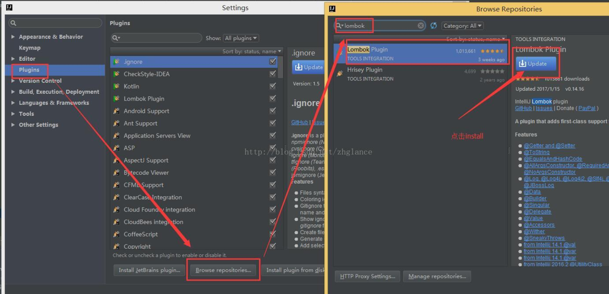

# IDEA安装lombok及使用详解

> 项目中经常使用bean，entity等类，绝大部分数据类类中都需要get、set、toString、equals和hashCode方法，虽然eclipse和idea开发环境下都有自 动生成的快捷方式，但自动生成这些代码后，如果bean中的属性一旦有修改、删除或增加时，需要重新生成或删除get/set等方法，给代码维护增加负担。而使用了lombok则不一样，使用了lombok的注解
(`@Setter`,`@Getter`,`@ToString`,`@RequiredArgsConstructor`,`@EqualsAndHashCode`或`@Data`)之后，就不需要编写或生成get/set等方法，很大程度上减少了代码量，而且减少了代码维护的负担。故强烈建议项目中使用`lombok`，去掉bean中get、set、toString、equals和hashCode等方法的代码。

#### 1、安装lombok插件





### 2、添加`lombok`的maven的`pom.xml`依赖：
```xml
<dependency>
	  <groupId>org.projectlombok</groupId>
	  <artifactId>lombok</artifactId>
	  <version>1.16.10</version>
</dependency>
  ```

### 3、示例代码`Student.java`

```
package com.lombok.demo;

import lombok.EqualsAndHashCode;
import lombok.Getter;
import lombok.Setter;
import lombok.ToString;

/**
 * Created by zhousiwei on 2017/2/8
 */
@Data
public class Student {
	private String name;
	private int age;
	private String male;
	private String studentNo;
}
```

**Tips:`@Data`注解的作用相当于`@Getter`,`@Setter `,`@RequiredArgsConstructor`,`@ToString`,`@EqualsAndHashCode`的合集。**