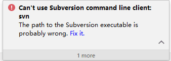
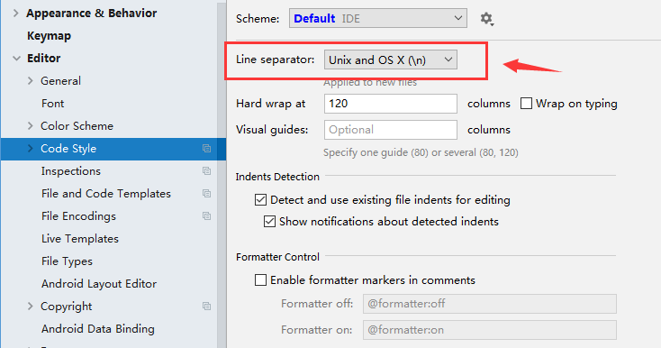
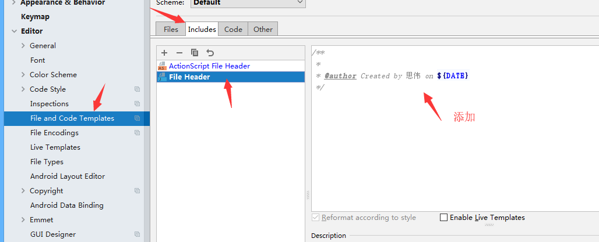

# IDEA设置后端代码开发规范

##### 1、IDEA 配置svn
提交svn报错：


###### 1.1、下载：[https://www.visualsvn.com/downloads/](https://www.visualsvn.com/downloads/)


###### 1.2、修改IDEA配置指向的路径：


----
##### 2、IDEA 设置 Tab 键为 4 个空格
Scheme 选择 ***Project*** ,在下面把取消勾选  ***Use tab character***


----
##### 3、IDEA 设置编码格式为 UTF-8


----
##### 4、IDEA 设置换行符为 Unix 编码格式



----
##### 5、IDEA 设置类注释模板



```java
/**
 * 
 * @author Created by 思伟 on ${DATE}
 */
```
----
