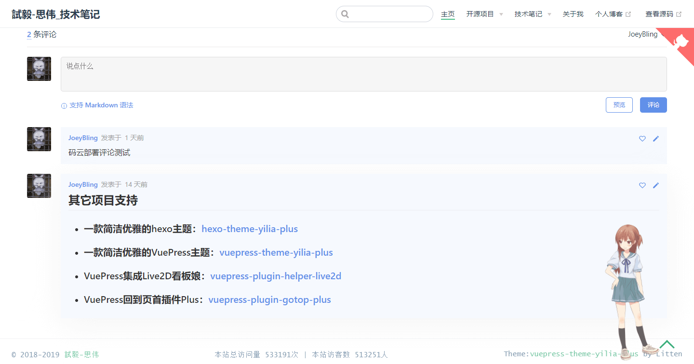

# VuePress集成Gitalk <GitHubLink repo="JoeyBling/vuepress-plugin-mygitalk"/>

```
.___  ___. ____    ____  _______  __  .___________.    ___       __       __  ___
|   \/   | \   \  /   / /  _____||  | |           |   /   \     |  |     |  |/  /
|  \  /  |  \   \/   / |  |  __  |  | `---|  |----`  /  ^  \    |  |     |  '  /
|  |\/|  |   \_    _/  |  | |_ | |  |     |  |      /  /_\  \   |  |     |    <
|  |  |  |     |  |    |  |__| | |  |     |  |     /  _____  \  |  `----.|  .  \
|__|  |__|     |__|     \______| |__|     |__|    /__/     \__\ |_______||__|\__\
```

[](https://www.npmjs.com/package/vuepress-plugin-mygitalk)

[](https://www.npmjs.com/package/vuepress-plugin-mygitalk)
[](https://www.npmjs.com/package/vuepress-plugin-mygitalk)
[](https://www.npmjs.com/package/vuepress-plugin-mygitalk)


[](https://zhousiwei.gitee.io "Author")
[](https://v1.vuepress.vuejs.org/zh/)
[](https://github.com/JoeyBling/vuepress-theme-yilia-plus)
[](https://jq.qq.com/?_wv=1027&k=58Ypj9z "博客搭建交流群")

------------------

> **欢迎使用和Star支持，如使用过程中碰到问题，可以提出[Issue](https://github.com/JoeyBling/vuepress-plugin-mygitalk/issues)，我会尽力完善**

## 介绍
&#160;&#160;&#160;&#160;**VuePress集成[Gitalk](https://github.com/gitalk/gitalk). | [Gitalk](https://github.com/gitalk/gitalk) plugin for VuePress.**

- 功能还很少，欢迎各位给我提意见和建议~
- [vuepress-plugin-mygitalk](https://github.com/JoeyBling/vuepress-plugin-mygitalk) 是为 [VuePress](https://v1.vuepress.vuejs.org/zh/) `1.0.0+`制作的插件。
- [Gitalk文档](https://github.com/gitalk/gitalk/blob/master/readme-cn.md#%E8%AE%BE%E7%BD%AE)
- 关于申请并配置第三方应用请查看 ➡️ [https://www.jianshu.com/p/ac7658cc912f](https://www.jianshu.com/p/ac7658cc912f)

## 线上预览

> **预览 ➡️ [https://zhousiwei.gitee.io/ibooks](https://zhousiwei.gitee.io/ibooks)**

## 推荐一款VuePress主题
> **一款简洁优雅的VuePress主题 ➡️ [https://github.com/JoeyBling/vuepress-theme-yilia-plus](https://github.com/JoeyBling/vuepress-theme-yilia-plus)**

## 效果截图



## 安装

```bash
yarn add vuepress-plugin-mygitalk
# or
npm install vuepress-plugin-mygitalk --save
```

------------

## 开始使用

### 引入该插件

在配置文件中引入 `vuepress-plugin-mygitalk`

> 查看 [官方文档](https://v1.vuepress.vuejs.org/zh/plugin/using-a-plugin.html)。

```javascript
module.exports = {
  plugins: [
    [
      'vuepress-plugin-mygitalk'
    ],
  ],
}
```

### 插件配置

```javascript
module.exports = {
  plugins: [
    [
      'vuepress-plugin-mygitalk', {
        // 是否启用(关闭请设置为false)(default: true)
        enable: true,
        // 是否开启首页评论(default: true)
        home: true,
        // Gitalk配置
        gitalk: {
          // GitHub Application Client ID.
          clientID: '',
          // GitHub Application Client Secret.
          clientSecret: '',
          // GitHub repository. 存储评论的 repo
          repo: '',
          // GitHub repository 所有者，可以是个人或者组织。
          owner: '',
          // 设置语言(default: zh-CN)
          language: 'zh-CN',
        }
      }
    ],
  ],
}
```

## 其他项目支持

- ### 一款简洁优雅的hexo主题：[hexo-theme-yilia-plus](https://github.com/JoeyBling/hexo-theme-yilia-plus)
- ### 一款简洁优雅的VuePress主题：[vuepress-theme-yilia-plus](https://github.com/JoeyBling/vuepress-theme-yilia-plus)
- ### VuePress集成Live2D看板娘：[vuepress-plugin-helper-live2d](https://github.com/JoeyBling/vuepress-plugin-helper-live2d)
- ### VuePress集成Gitalk：[vuepress-plugin-mygitalk](https://github.com/JoeyBling/vuepress-plugin-mygitalk)
- ### VuePress回到页首插件Plus：[vuepress-plugin-gotop-plus](https://github.com/JoeyBling/vuepress-plugin-gotop-plus)

## 捐赠
&#160;&#160;&#160;&#160;**如果感觉对您有帮助，请作者喝杯咖啡吧，请注明您的名字或者昵称，方便作者感谢o(*￣︶￣*)o**

| 微信 | 支付宝 |
| :---: | :---: |
|  |  |

## 关于我
- [个人博客](https://zhousiwei.gitee.io/)
- [技术笔记](https://zhousiwei.gitee.io/ibooks/)
- [GitHub](https://github.com/JoeyBling)
- [码云](https://gitee.com/zhousiwei)
- [简书](https://www.jianshu.com/u/02cbf31a043a)
- [CSDN](https://blog.csdn.net/qq_30930805)
- [知乎](https://www.zhihu.com/people/joeybling)
- [微博](http://weibo.com/jayinfo)
- **主要涉及技术：`Java后端开发`、`聚合支付`、`公众号开发`、`开源爱好者`、`Linux`**

## LICENSE

[](./LICENSE "LICENSE")